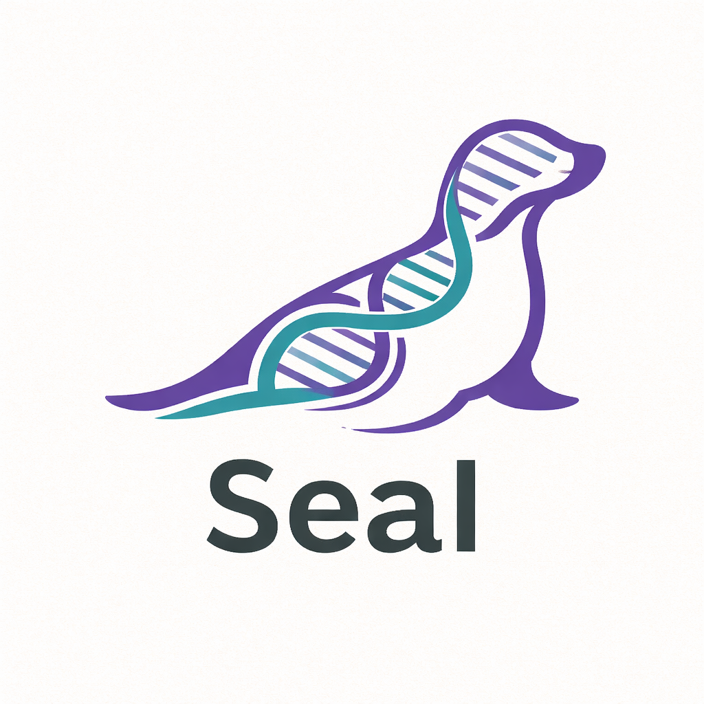
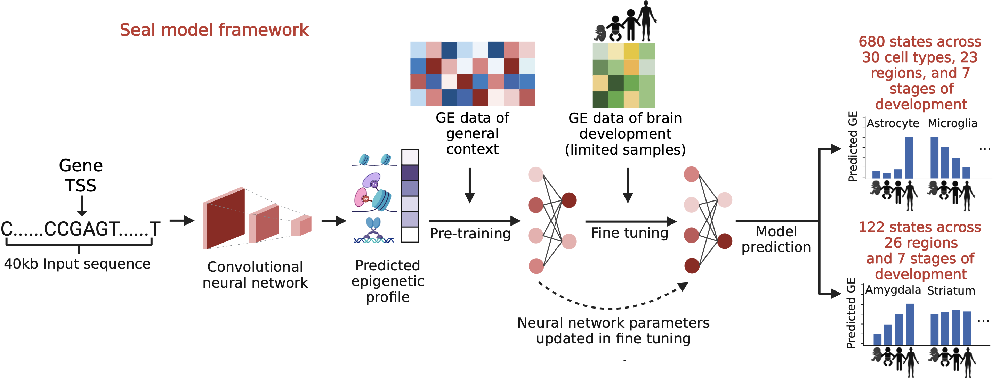
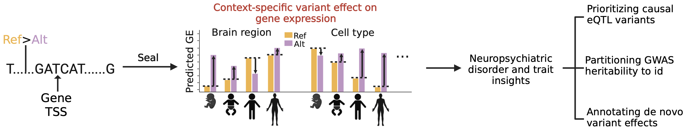

<p align="center">
  
</p>

# *Seal*: A Transfer Learning Framework for Sequence-Based Expression Modeling with Spatiotemporal Cell State Resolution

**Yun Hao, Christopher Y. Park, Chandra L. Theesfeld, and Olga G. Troyanskaya**

**Flatiron Institute, Princeton University**

Understanding how genetic variation influences gene expression in specific cellular contexts is a central challenge in human genetics and neuroscience. This problem is particularly acute in the context of human brain development, where gene regulation varies across brain regions, cell types, and stages of development, many of which are transient and difficult to profile experimentally. Seal addresses this challenge by providing a sequence-based framework for predicting gene expression and variant effects across 802 brain-specific contexts, including 122 brain region states spanning 26 regions and 7 stages, and 680 cell states spanning 30 cell types across 23 regions and 7 stages. In benchmarking, Seal demonstrates strong performance in capturing cell-state-specific gene expression patterns, with improved resolution compared to existing sequence-based models such as Enformer and AlphaGenome.

<p align="center">
  
</p>

Seal adopts a transfer learning framework that enables accurate modeling in data-scarce settings (shown in the Figure above). First, a convolutional neural network takes a 40 kb DNA sequence centered around each gene’s transcription start site (±20 kb) and transforms it into a rich set of 2,002 epigenomic features, including 690 transcription factor (TF) binding profiles, 978 histone modification marks, and 334 DNase hypersensitivity signals. These features are computed across sliding windows along the sequence and subsequently aggregated using exponential decay functions that assign higher weights to regions proximal to the TSS, capturing spatial regulatory effects. This spatial integration reduces the feature space to 20,020 sequence-derived features used as input for downstream modeling. In the pre-training stage, a multilayer perceptron learns a shared latent regulatory representation from large-scale gene expression datasets across general contexts. During fine-tuning, this representation is adapted to the context-specific gene expression profiling of brain region states and cell states by updating only a subset of model parameters, allowing robust prediction even when data are limited.

<p align="center">
  
</p>

To predict variant effects, Seal compares model outputs between reference and alternative alleles (shown in the Figure above). For each variant, the surrounding sequence is passed through the trained model to generate predicted gene expression, and the difference between alleles is interpreted as the variant’s regulatory effect. Because predictions are derived directly from sequence, Seal can evaluate any variant independently of population frequency or linkage disequilibrium. In addition, the model provides feature attribution scores that link variant effects to underlying regulatory mechanisms, such as disruption of transcription factor binding or chromatin states, enabling both prioritization and mechanistic interpretation of genetic variants.

The Seal framework is described in the following manuscript: [Link]()

## Setup 

### Requirements

Seal requires Python 3.6+ and Python packages PyTorch (>=1.9). Follow PyTorch installation steps [here](https://pytorch.org/). The other dependencies can be installed by running `pip install -r requirements.txt`. Seal also relies on the 'closest-features' from BEDOPS for finding the closest representative TSS of each variant. Follow installation steps [here](https://bedops.readthedocs.io/en/latest/).

### Install 

Clone the repository then download and extract necessary resource files:
```bash
git clone https://github.com/FunctionLab/Seal.git
cd Seal
sh ./download_resources.sh
```

- [Seal model](https://doi.org/10.5281/zenodo.14104608)
- [Seal resource](https://doi.org/10.5281/zenodo.13368284)


## Usage

### Context-specific prediction of variant effects on expression

Command line ([example bash script](test/predict/test_var_predict.sh)):
```bash
python seal_predict.py --vcf_file <variant vcf file> --model_info_file <Seal model summary file> --out_file <Output model prediction file>
```

Arguments:
- `--vcf_file`: input VCF file (hg19-based coordinate; [example](test/predict/test_var.vcf))
- `--model_info_file`: input Seal model info file (contains pre-trained and fine-tuned model file location and hidden layer info; [example](model/tissue_state_early_fetal_to_adult/tissue_state_early_fetal_to_adult_seal_model_summary.txt)) 
- `--out_file`: output result file of variant effect predictions ([example](test/predict/test_var_tissue_state_effect_pred.tsv)) 

Notes:
- Seal can predict gene expression of brain development at two levels of resolution: cell state and brain region state. The cell state model can predict variant effect on gene expression in 802 cell states including (i) 82 prefrontal cortex cell states across 6 stages from mid fetal to adulthood from scRNA-seq profling of 18 cell types in prefrontal cortex ([model info file](model/cell_state_mid_fetal_to_adult/cell_state_mid_fetal_to_adult_seal_model_summary.txt)); (ii) 598 cell states of early fetal stage from scRNA-seq profling of whole brain that involves 12 cell types in 23 brain regions ([model info file](model/cell_state_early_fetal/cell_state_early_fetal_seal_model_summary.txt)). The brain region state model can predict variant effects on gene expression under 122 brain region states across 7 stages from early fetal to adulthood from bulk RNA-seq profiling that invovles 26 brain regions ([model info file](model/tissue_state_early_fetal_to_adult/tissue_state_early_fetal_to_adult_seal_model_summary.txt)). For detailed information about the cell states and brain region states, please check [the annotation file](resource/cell_state_annotation.xlsx).

- Our models were trained with sequence from the hg19 reference genome assembly. Users can use [UCSC lift genome annotations](https://genome.ucsc.edu/cgi-bin/hgLiftOver) for liftover coordinates of other assembly to hg19. Alternatively, users can also replace the input gene annotation BED file (`--gene_bed_file` argument) and input reference genome fasta file (`--ref_genome_file` argument) with files of the preferred assembly.  

### Training a sequence-to-expression transfer learning model from scratch 

Command line ([example bash script](test/train/test_train_from_scratch.sh)):
```bash
python seal_train.py --general_exp_file <general context expression file> --n_latent <number of hidden neurons> --lr_pretrain <pre-training learning rate> --l2_pretrain <pre-training L2 regularization factor> --general_context_group <general context group info file> --spec_gene_weight <weight assigned to specific genes> --finetune_exp_file <specific context expression file> --lr_finetune <fine-tuning learning rate> --l2_finetune <fine-tuning L2 regularization factor> --specific_context_group <specific context group info file> --out_name <output file location>
```

Arguments:
- `--general_exp_file`: expression matrix .tsv file of general contexts for pre-training. First column contains gene id. Second to last columns contain normalized expression value. ([example](resource/geneanno.exp.csv_general_brain.tsv))
- `--n_latent`: number of hidden neurons for the Module 3 transfer learning neural network model of Seal framework 
- `--lr_pretrain`: learning rate in pre-training for the Module 3 transfer learning neural network model of Seal framework
- `--l2_pretrain`: L2 regularization factor in pre-training for the Module 3 transfer learning neural network model of Seal framework
- `--general_context_group`: group info .tsv file of general contexts for gene-weighting of neural network loss function. First column contains the group name. Second column contains the column ID among expression matrix columns. If provided, gene weights will be assigned separately for each context group, based on the expression variation within each group. If not provided (default setting), genes weights will be assigned based on the expression variation across all contexts ([example](resource/brain_dev_exp_tissue_group.tsv)). 
- `--spec_gene_weight`: the weight score assigned to genes with high expression variation (by default, score of `1/spec_gene_weight` will be assigned to genes with low expression variation). 
- `--finetune_exp_file`: expression matrix .tsv file of general contexts for fine-tuning. Same format as `--general_exp_file`
- `--lr_finetune`: learning rate in fine-tuning for the Module 3 transfer learning neural network model of Seal framework
- `--l2_finetune`: L2 regularization factor in fine-tuning for the Module 3 transfer learning neural network model of Seal framework
- `--specific_context_group`:  group info .tsv file of specific contexts for gene-weighting of neural network loss function. Same format as `--general_context_group`
- `--out_name`: path for output. All output files will be named and stored based on the specific path. 

### Fine-tuning a pre-trained model for predicting gene expression under specific contexts

Command line ([example bash script](test/train/test_train_from_pretrained.sh)): 
```bash
python seal_train.py --general_exp_file <general context expression file> --pretrained <True> --pretrained_name <pre-trained file location> --n_latent <number of hidden neurons> --spec_gene_weight <weight assigned to specific genes> --finetune_exp_file <specific context expression file> --lr_finetune <fine-tuning learning rate> --l2_finetune <fine-tuning L2 regularization factor> --specific_context_group <specific context group info file> --out_name <output file location>
```

Additional arguments: 
- `--pretrained`: bool specifying whether the pretrained model exists (True in this case)
- `--pretrained_name`: path where pre-trained files are stored. Same format as `--out_name`. Pre-trained files will be loaded based on the specified path and our naming scheme.

### Interpreting trained transfer learning model to compute attribution scores of chromatin features

Command line ([example bash script](test/interpret/test_var_interpret.sh)):
```bash
python seal_interpret.py --vcf_file <variant vcf file> --model_info_file <Seal model summary file> --interpret_method <interpretation method> --outcome_id <outcome index> --out_file <output feature attribution file>
```

Arguments:
- `--vcf_file`: input VCF file (hg19-based coordinate; [example](test/predict/test_var.vcf))
- `--model_info_file`: input Seal model info file (contains pre-trained and fine-tuned model file location and hidden layer info; [example](model/tissue_state_early_fetal_to_adult/tissue_state_early_fetal_to_adult_seal_model_summary.txt))
- `-interpret_method`: interpretation method to be implemented; (Method options: 'saliency', 'integratedGradients', 'deeplift', 'kernalShap', 'gradientShap', 'lime')
- `--outcome_id`: column index of outcome to be interpreted  
- `--out_file`: output feature attribution file ([example](test/interpret/test_var_tissue_state_early_fetal_to_adult_deeplift_attribution_score_outcome_0.npy))


## Help
Please post in the Github issues or e-mail Yun Hao [yhao@flatironinstitute.org](mailto:yhao@flatironinstitute.org) with any questions about the repository, requests for more data, etc.

## References
Avsec, Ž. et al. Effective gene expression prediction from sequence by integrating long-range interactions. Nat Methods 18, 1196–1203 (2021).
Avsec, Ž. et al. Advancing regulatory variant effect prediction with AlphaGenome. Nature 649, 1206–1218 (2026).
Herring, C. A. et al. Human prefrontal cortex gene regulatory dynamics from gestation to adulthood at single-cell resolution. Cell 185, 4428–4447.e28 (2022).
Braun, E. et al. Comprehensive cell atlas of the first-trimester developing human brain. Science 382, eadf1226 (2023).
Wang, D. et al. Comprehensive functional genomic resource and integrative model for the human brain. Science 362, (2018).

